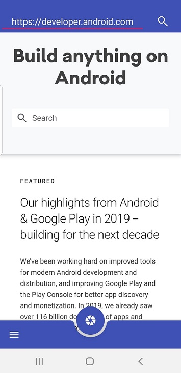

# MeldCX Capture a Web Site
 ## App Architecture
  The app use MVP architecture using ModelView.the app desing to scale from mediam to larger
 ## How to use 
  - type a url and press search 
  - then (after loading) capture the image pressing middle icon at bottem 
  - press list icon to view captured images (stored in mobile)    
 ## Technologies in use 
  - Dagger 2
  - Kotlin
  - Espresso and JUnit (Testing)
  - Material Theme
  - Glide (Image display)
 ## Requirements
  - Gradle 3.5.3
  - Kotlin 1.3.61
  - Android build tool - 29.0.0
  - Android SDK Min -26 Target - 28 
  - Java Latest  
 ## How to Install 
  - download or git clone (https://github.com/wnasaindika/MeldCX.git)
  - open in android studio. then sync and run in a real device or emulator 
 ## How to run test 
  - open test package (instrument) and run the app (Not covering all te test cases)
 ## Sample App images 
  